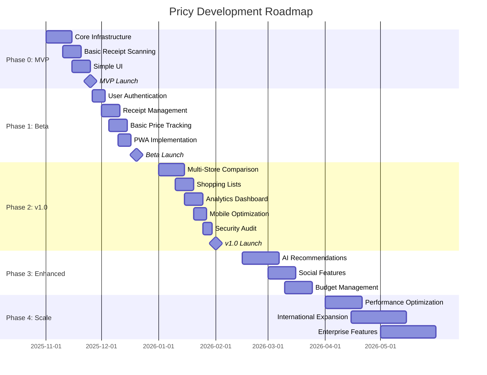

# Pricy Product Roadmap

> **Strategic roadmap for Pricy development from MVP to Release 1.0 and beyond**  
> Last Updated: October 24, 2025  
> Status: Active Development

## Table of Contents

1. [Vision & Strategy](#vision--strategy)
2. [Milestone Overview](#milestone-overview)
3. [Phase 0: MVP](#phase-0-mvp-minimum-viable-product)
4. [Phase 1: Beta](#phase-1-beta-release)
5. [Phase 2: Release 1.0](#phase-2-release-10-production-ready)
6. [Phase 3: Enhanced Features](#phase-3-enhanced-features)
7. [Phase 4: Scale & Optimize](#phase-4-scale--optimize)
8. [Future Considerations](#future-considerations)
9. [Success Metrics](#success-metrics)

---

## Vision & Strategy

### Product Vision

**"Empower consumers to make smarter purchasing decisions by digitizing receipts and providing actionable price insights."**

### Core Value Propositions

1. **Receipt Digitization**: Effortless scanning and OCR processing
2. **Price Tracking**: Historical price data and trend analysis
3. **Smart Shopping**: Price comparisons and savings recommendations
4. **Organized Archive**: Searchable receipt history with tax preparation support

### Target Market

- **Primary**: Budget-conscious consumers (25-45 years old)
- **Secondary**: Small business owners tracking expenses
- **Geographic**: Initial launch in USA/Canada, expand to EU/Asia

### Competitive Advantages

- ✅ **Multiple OCR providers** (fallback for accuracy)
- ✅ **ML-powered product matching** (semantic search with pgvector)
- ✅ **PWA with offline support** (works without internet)
- ✅ **Privacy-first** (self-hosted option available)
- ✅ **Open architecture** (extensible microservices)

---

## Milestone Overview



### Timeline Summary

| Phase                 | Duration | Target Date  | Status         |
| --------------------- | -------- | ------------ | -------------- |
| **Phase 0: MVP**      | 4 weeks  | Nov 25, 2025 | 🟢 In Progress |
| **Phase 1: Beta**     | 4 weeks  | Dec 20, 2025 | 🟡 Planning    |
| **Phase 2: v1.0**     | 6 weeks  | Feb 1, 2026  | ⚪ Planned     |
| **Phase 3: Enhanced** | 8 weeks  | Mar 30, 2026 | ⚪ Planned     |
| **Phase 4: Scale**    | 12 weeks | Jun 30, 2026 | ⚪ Future      |

---

## Phase 0: MVP (Minimum Viable Product)

**Goal**: Validate core concept with minimal features  
**Duration**: 4 weeks  
**Target Date**: November 25, 2025  
**User Target**: 50 early adopters

### Core Features

#### ✅ M0.1: Infrastructure Setup (Week 1)

**Deliverables:**

- [x] Monorepo structure (Turborepo + pnpm)
- [x] Database setup (PostgreSQL + Prisma)
- [x] Basic API Gateway (Fastify)
- [x] Development environment (Docker Compose)
- [x] CI/CD pipeline (GitHub Actions)

**Acceptance Criteria:**

- All services start with `pnpm dev`
- Database migrations run successfully
- Basic health checks pass
- Docker Compose orchestrates all services

#### 🟢 M0.2: Receipt Upload & OCR (Week 2)

**Deliverables:**

- [ ] Image upload endpoint (`POST /api/v1/receipts/upload`)
- [ ] S3/MinIO storage integration
- [ ] OCR service with Tesseract.js (local fallback)
- [ ] Receipt text extraction
- [ ] Basic store detection
- [ ] Item extraction (name, price, quantity)

**Acceptance Criteria:**

- Users can upload JPG/PNG receipts (max 10MB)
- OCR processes receipt in <30 seconds
- Extracts at least 70% of items accurately
- Stores receipt data in database
- Returns processing status to user

**Technical Debt:**

- ⚠️ Only Tesseract (no cloud OCR yet)
- ⚠️ Limited store templates
- ⚠️ No manual correction UI

#### 🟢 M0.3: Basic Receipt List UI (Week 2-3)

**Deliverables:**

- [ ] Next.js app setup
- [ ] Receipt upload form
- [ ] Receipt list view (chronological)
- [ ] Receipt detail view
- [ ] Basic responsive design (mobile-first)

**Acceptance Criteria:**

- Users can see uploaded receipts
- Click receipt to view items
- Basic styling (no design system yet)
- Works on mobile browsers
- Shows processing status

**Technical Debt:**

- ⚠️ No authentication (all receipts public)
- ⚠️ No pagination
- ⚠️ Minimal error handling

#### 🟡 M0.4: MVP Launch Preparation (Week 4)

**Deliverables:**

- [ ] Landing page with value proposition
- [ ] Demo video/screenshots
- [ ] Basic documentation (README)
- [ ] Deployment to staging (Vercel + Railway)
- [ ] Error tracking (Sentry)
- [ ] Analytics (Plausible or Google Analytics)

**Acceptance Criteria:**

- App accessible at `mvp.pricy.app`
- Landing page converts 10%+ visitors
- No critical bugs in error logs
- Analytics tracking events

### Success Metrics (MVP)

| Metric              | Target        | Measurement              |
| ------------------- | ------------- | ------------------------ |
| **User Signups**    | 50 users      | Analytics dashboard      |
| **Receipt Uploads** | 200 receipts  | Database count           |
| **OCR Accuracy**    | 70%+          | Manual validation sample |
| **App Performance** | <3s load time | Lighthouse CI            |
| **Error Rate**      | <5%           | Sentry dashboard         |
| **User Retention**  | 30% (week 2)  | Return visits            |

### Exit Criteria

✅ **Proceed to Beta if:**

- 50+ users signed up
- 70%+ OCR accuracy achieved
- <5% error rate
- Positive user feedback (NPS >30)

❌ **Pivot/Reconsider if:**

- <20 users after 2 weeks
- OCR accuracy <50%
- Negative user feedback

---

## Phase 1: Beta Release

**Goal**: Production-ready core features with user management  
**Duration**: 4 weeks  
**Target Date**: December 20, 2025  
**User Target**: 500 beta users

### Core Features

#### 🟡 M1.1: User Authentication (Week 1)

**Deliverables:**

- [ ] NextAuth.js v5 integration
- [ ] Email/password authentication
- [ ] Google OAuth 2.0
- [ ] Microsoft OAuth 2.0
- [ ] User profile management
- [ ] Session management (JWT + refresh tokens)

**Acceptance Criteria:**

- Users can register with email/password
- Social login works (Google, Microsoft)
- Secure JWT tokens (15min access, 7d refresh)
- User dashboard shows profile
- PKCE implemented for OAuth

**API Endpoints:**

- `POST /api/v1/auth/register`
- `POST /api/v1/auth/login`
- `POST /api/v1/auth/refresh`
- `POST /api/v1/auth/logout`
- `GET /api/v1/auth/me`

#### 🟡 M1.2: Receipt Management (Week 1-2)

**Deliverables:**

- [ ] Receipt ownership (user-scoped)
- [ ] Receipt CRUD operations
- [ ] Receipt search (by store, date, item)
- [ ] Receipt categories/tags
- [ ] Export receipts (PDF, CSV)
- [ ] Receipt deletion (GDPR compliance)

**Acceptance Criteria:**

- Users only see their own receipts
- Search returns results in <1s
- Export includes all receipt data
- Delete removes all traces (GDPR)

**API Endpoints:**

- `GET /api/v1/receipts` (paginated)
- `GET /api/v1/receipts/:id`
- `PATCH /api/v1/receipts/:id`
- `DELETE /api/v1/receipts/:id`
- `GET /api/v1/receipts/search?q=...`

#### 🟡 M1.3: Enhanced OCR (Week 2)

**Deliverables:**

- [ ] Google Cloud Vision API integration
- [ ] AWS Textract integration (optional)
- [ ] OCR provider fallback chain
- [ ] Manual correction interface
- [ ] Improved store detection (50+ templates)
- [ ] Item categorization (groceries, electronics, etc.)

**Acceptance Criteria:**

- 85%+ OCR accuracy with cloud providers
- Fallback works if primary fails
- Users can manually edit extracted data
- Store detection for 50+ major retailers

**Technical Implementation:**

```typescript
// OCR provider fallback chain
const ocrProviders = [
  new GoogleVisionOCR(), // Primary
  new AWSTextractOCR(), // Secondary
  new TesseractOCR(), // Fallback
];
```

#### 🟡 M1.4: Price Tracking (Week 2-3)

**Deliverables:**

- [ ] Product database with embeddings
- [ ] Product matching algorithm (ML-based)
- [ ] Price history tracking
- [ ] Price change notifications
- [ ] Price comparison (same product, different stores)

**Acceptance Criteria:**

- Products matched with 80%+ accuracy
- Price history chart displays trends
- Users receive notifications on price drops
- Comparison shows cheapest store

**Database Schema:**

```prisma
model Product {
  id          String   @id @default(uuid())
  name        String
  category    String?
  embedding   Vector(768)  // ML embeddings
  priceHistory PriceHistory[]

  @@index([embedding], type: IvfFlat)
}

model PriceHistory {
  id          String   @id @default(uuid())
  productId   String
  storeId     String
  price       Decimal
  date        DateTime
  receiptId   String
}
```

#### 🟡 M1.5: PWA Implementation (Week 3-4)

**Deliverables:**

- [ ] PWA manifest (icons, splash screens)
- [ ] Service worker for offline support
- [ ] Background sync for uploads
- [ ] Push notifications
- [ ] Add to Home Screen prompt
- [ ] Offline receipt viewing

**Acceptance Criteria:**

- Lighthouse PWA score >90
- App installs on mobile devices
- Offline mode works (cached receipts)
- Background sync uploads when online
- Push notifications for price drops

**PWA Configuration:**

```json
{
  "name": "Pricy - Receipt Scanner",
  "short_name": "Pricy",
  "start_url": "/",
  "display": "standalone",
  "background_color": "#ffffff",
  "theme_color": "#3b82f6",
  "orientation": "portrait"
}
```

#### 🟡 M1.6: Beta Testing Program (Week 4)

**Deliverables:**

- [ ] Beta signup form with waitlist
- [ ] User onboarding flow
- [ ] In-app feedback widget
- [ ] User testing sessions (5-10 users)
- [ ] Bug tracking system (Linear/GitHub Issues)
- [ ] Beta tester incentives (early access, credits)

**Acceptance Criteria:**

- 500 beta users registered
- Onboarding completion rate >70%
- Feedback collected from 50+ users
- Critical bugs fixed within 24h

### Success Metrics (Beta)

| Metric                 | Target         | Measurement       |
| ---------------------- | -------------- | ----------------- |
| **Beta Users**         | 500 users      | Database count    |
| **Active Users**       | 200 DAU        | Analytics         |
| **OCR Accuracy**       | 85%+           | Validation sample |
| **Product Match**      | 80%+           | Manual review     |
| **App Performance**    | Lighthouse >90 | CI checks         |
| **Error Rate**         | <2%            | Sentry            |
| **NPS Score**          | >40            | In-app surveys    |
| **Retention (Week 2)** | 50%+           | Analytics         |

### Exit Criteria

✅ **Proceed to v1.0 if:**

- 500+ beta users, 200+ active
- 85%+ OCR accuracy
- 80%+ product matching
- NPS >40
- <2% error rate

---

## Phase 2: Release 1.0 (Production Ready)

**Goal**: Feature-complete, polished, production-ready application  
**Duration**: 6 weeks  
**Target Date**: February 1, 2026  
**User Target**: 5,000 users

### Core Features

#### ⚪ M2.1: Multi-Store Price Comparison (Week 1-2)

**Deliverables:**

- [ ] Price comparison dashboard
- [ ] Same product across stores visualization
- [ ] Best price recommendations
- [ ] Price alerts (user-defined thresholds)
- [ ] Store preference settings
- [ ] Savings calculator (vs. average price)

**Acceptance Criteria:**

- Compare prices across 3+ stores
- Visual charts show price differences
- Alerts trigger within 15 minutes
- Savings calculations accurate
- Users can set preferred stores

**UI Components:**

```typescript
<PriceComparisonCard
  product={product}
  stores={[walmart, target, costco]}
  userPreferences={preferences}
/>
```

#### ⚪ M2.2: Shopping Lists (Week 2-3)

**Deliverables:**

- [ ] Create/edit shopping lists
- [ ] Add items manually or from receipts
- [ ] Price estimation (based on history)
- [ ] Store recommendations (cheapest for list)
- [ ] Shopping list sharing (family/roommates)
- [ ] Check off items while shopping
- [ ] Smart suggestions (frequently bought items)

**Acceptance Criteria:**

- Create unlimited lists
- Share lists via link
- Real-time updates for shared lists
- Price estimation within 10% accuracy
- Suggest store with best total price

**Database Schema:**

```prisma
model ShoppingList {
  id          String   @id @default(uuid())
  userId      String
  name        String
  items       ShoppingListItem[]
  sharedWith  User[]
  createdAt   DateTime @default(now())
}

model ShoppingListItem {
  id              String   @id @default(uuid())
  shoppingListId  String
  productId       String?
  name            String
  quantity        Int
  estimatedPrice  Decimal?
  checked         Boolean  @default(false)
}
```

#### ⚪ M2.3: Analytics Dashboard (Week 3-4)

**Deliverables:**

- [ ] Spending analytics by category
- [ ] Monthly/yearly spending trends
- [ ] Store spending breakdown
- [ ] Top purchased items
- [ ] Price trend charts
- [ ] Budget tracking (vs. actual)
- [ ] Export reports (PDF, CSV)

**Acceptance Criteria:**

- Dashboard loads in <2s
- Interactive charts (filter by date, store, category)
- Export generates within 5s
- Data accurate to database
- Mobile-responsive charts

**Analytics Components:**

```typescript
<SpendingChart type="monthly" />
<CategoryBreakdown />
<StoreComparison />
<TopItems limit={10} />
<BudgetProgress budget={userBudget} />
```

#### ⚪ M2.4: Mobile App Optimization (Week 4)

**Deliverables:**

- [ ] Camera integration (take receipt photo)
- [ ] Touch gestures (swipe, pinch-to-zoom)
- [ ] Native-like animations
- [ ] Optimized bundle size (<500KB)
- [ ] Fast 3G performance (<5s load)
- [ ] Battery-efficient background sync

**Acceptance Criteria:**

- Camera captures receipt in-app
- Smooth animations (60fps)
- App loads on 3G in <5s
- Battery drain <5% per hour active use
- Lighthouse mobile score >85

#### ⚪ M2.5: Design System & Polish (Week 4-5)

**Deliverables:**

- [ ] Complete design system (shadcn/ui)
- [ ] Consistent typography, colors, spacing
- [ ] Micro-interactions and animations
- [ ] Loading states for all async operations
- [ ] Empty states with helpful messaging
- [ ] Error states with recovery options
- [ ] Dark mode support
- [ ] Accessibility audit (WCAG 2.1 AA)

**Acceptance Criteria:**

- All components use design system
- Dark mode toggles smoothly
- Axe accessibility score 100
- Keyboard navigation works
- Screen reader compatible

#### ⚪ M2.6: Security Audit & Compliance (Week 5)

**Deliverables:**

- [ ] Third-party security audit
- [ ] Penetration testing
- [ ] GDPR compliance review
- [ ] Privacy policy
- [ ] Terms of service
- [ ] Cookie consent (EU)
- [ ] Data export functionality
- [ ] Account deletion (right to be forgotten)

**Acceptance Criteria:**

- Zero critical security vulnerabilities
- GDPR compliant (verified by legal)
- Privacy policy approved
- Data export works (JSON format)
- Account deletion removes all data

**Security Checklist:**

- [ ] OAuth 2.0 with PKCE
- [ ] Short-lived JWT tokens (15min)
- [ ] Rate limiting on all endpoints
- [ ] SQL injection prevention (Prisma)
- [ ] XSS prevention (React escaping)
- [ ] CSRF protection (SameSite cookies)
- [ ] Secrets in environment variables
- [ ] Encrypted database backups

#### ⚪ M2.7: Performance Optimization (Week 5-6)

**Deliverables:**

- [ ] Database query optimization (indexes)
- [ ] Redis caching (frequently accessed data)
- [ ] CDN for static assets
- [ ] Image optimization (WebP, lazy loading)
- [ ] Code splitting (route-based)
- [ ] Bundle size reduction (<300KB)
- [ ] Server-side rendering (SSR)
- [ ] Edge caching (Vercel Edge)

**Acceptance Criteria:**

- Lighthouse performance >95
- Core Web Vitals green (LCP <2.5s, FID <100ms, CLS <0.1)
- API response times <500ms (p95)
- Database queries <100ms (p95)
- Cache hit rate >70%

**Performance Targets:**
| Metric | Target | Current | Status |
|--------|--------|---------|--------|
| Lighthouse Score | >95 | TBD | ⚪ |
| LCP (Largest Contentful Paint) | <2.5s | TBD | ⚪ |
| FID (First Input Delay) | <100ms | TBD | ⚪ |
| CLS (Cumulative Layout Shift) | <0.1 | TBD | ⚪ |
| API Response Time (p95) | <500ms | TBD | ⚪ |
| Database Query Time (p95) | <100ms | TBD | ⚪ |

#### ⚪ M2.8: v1.0 Launch (Week 6)

**Deliverables:**

- [ ] Production deployment (Vercel + AWS/GCP)
- [ ] Monitoring dashboards (Grafana)
- [ ] On-call rotation setup
- [ ] Incident response playbook
- [ ] Marketing website launch
- [ ] Product Hunt launch
- [ ] Press release
- [ ] Social media campaign

**Acceptance Criteria:**

- 99.9% uptime SLA
- Zero critical bugs in first week
- Product Hunt ranking Top 10
- 5,000 users in first month
- Press coverage (3+ publications)

### Success Metrics (v1.0)

| Metric                      | Target       | Measurement       |
| --------------------------- | ------------ | ----------------- |
| **Total Users**             | 5,000        | Database count    |
| **Active Users (DAU)**      | 1,000        | Analytics         |
| **Receipts Processed**      | 50,000       | Database count    |
| **OCR Accuracy**            | 90%+         | Validation sample |
| **Product Match Accuracy**  | 85%+         | Manual review     |
| **Uptime**                  | 99.9%        | Monitoring        |
| **API Response Time (p95)** | <500ms       | APM               |
| **Error Rate**              | <1%          | Sentry            |
| **NPS Score**               | >50          | In-app surveys    |
| **Customer Satisfaction**   | 4.5/5 stars  | App stores        |
| **Retention (Week 4)**      | 60%+         | Analytics         |
| **Churn Rate**              | <10% monthly | Analytics         |

### Exit Criteria

✅ **v1.0 Success:**

- 5,000+ users in first month
- 99.9% uptime
- NPS >50
- 4.5+ star rating
- <1% error rate

---

## Phase 3: Enhanced Features

**Goal**: AI-powered features, social elements, advanced budgeting  
**Duration**: 8 weeks  
**Target Date**: March 30, 2026  
**User Target**: 20,000 users

### Core Features

#### ⚪ M3.1: AI-Powered Recommendations (Week 1-3)

**Deliverables:**

- [ ] Purchase pattern analysis
- [ ] Smart product substitution suggestions
- [ ] Budget-friendly alternatives
- [ ] Seasonal buying recommendations
- [ ] Bulk buying optimization
- [ ] Price drop predictions (ML model)
- [ ] Personalized deals/coupons

**Acceptance Criteria:**

- Recommendations relevant 80%+ of time
- Savings suggestions save 15%+ on average
- Price drop predictions accurate within 5%
- Users engage with 30%+ of recommendations

**ML Pipeline:**

```python
# Price prediction model
class PricePredictionModel:
    def __init__(self):
        self.model = XGBoostRegressor()
        self.features = [
            'product_category',
            'store',
            'season',
            'day_of_week',
            'historical_prices',
            'competitor_prices'
        ]

    def predict_price_drop(self, product_id):
        # Returns probability of price drop in next 7 days
        return self.model.predict_proba(features)
```

#### ⚪ M3.2: Social Features (Week 3-5)

**Deliverables:**

- [ ] Share receipts/shopping lists with friends
- [ ] Family account management
- [ ] Split expenses (roommates, couples)
- [ ] Community price reporting
- [ ] Deal sharing
- [ ] Store reviews and ratings
- [ ] Follow users for shopping tips

**Acceptance Criteria:**

- Users can create family groups (up to 5 members)
- Expense splitting accurate to cents
- Community prices verified and accurate
- Social features increase engagement 40%

**Social Architecture:**

```prisma
model FamilyGroup {
  id          String   @id @default(uuid())
  name        String
  members     User[]
  sharedLists ShoppingList[]
  sharedReceipts Receipt[]
}

model Expense {
  id          String   @id @default(uuid())
  receiptId   String
  totalAmount Decimal
  splits      ExpenseSplit[]
}

model ExpenseSplit {
  id          String   @id @default(uuid())
  expenseId   String
  userId      String
  amount      Decimal
  paid        Boolean  @default(false)
}
```

#### ⚪ M3.3: Advanced Budget Management (Week 5-7)

**Deliverables:**

- [ ] Multi-category budgets
- [ ] Budget templates (groceries, dining, etc.)
- [ ] Budget vs. actual tracking
- [ ] Overspending alerts
- [ ] Budget forecasting (ML-based)
- [ ] Bill reminders
- [ ] Savings goals

**Acceptance Criteria:**

- Users can set budgets for 10+ categories
- Alerts trigger within 1 hour of overspending
- Forecast accuracy within 10%
- 70%+ of users stay within budgets

**Budget Features:**

```typescript
<BudgetOverview
  categories={[
    { name: "Groceries", budget: 500, spent: 380 },
    { name: "Dining", budget: 200, spent: 210 },
    { name: "Shopping", budget: 300, spent: 150 },
  ]}
/>
```

#### ⚪ M3.4: Tax Preparation Support (Week 7-8)

**Deliverables:**

- [ ] Expense categorization for tax purposes
- [ ] Business expense tracking
- [ ] Mileage tracking
- [ ] Tax document generation
- [ ] Export to TurboTax/H&R Block
- [ ] Quarterly summaries
- [ ] Accountant sharing

**Acceptance Criteria:**

- Receipts categorized for IRS Schedule C
- Export compatible with tax software
- Quarterly summaries accurate
- CPAs can access client data (with permission)

### Success Metrics (Phase 3)

| Metric                        | Target        | Measurement        |
| ----------------------------- | ------------- | ------------------ |
| **Total Users**               | 20,000        | Database count     |
| **Active Users (DAU)**        | 5,000         | Analytics          |
| **Recommendation Engagement** | 30%+          | Click-through rate |
| **Family Groups Created**     | 2,000+        | Database count     |
| **Budget Usage**              | 60%+ of users | Feature adoption   |
| **Tax Export Downloads**      | 500+ (Q1)     | Downloads          |
| **NPS Score**                 | >60           | Surveys            |
| **Retention (Month 2)**       | 70%+          | Analytics          |

---

## Phase 4: Scale & Optimize

**Goal**: Global expansion, enterprise features, performance at scale  
**Duration**: 12 weeks  
**Target Date**: June 30, 2026  
**User Target**: 100,000 users

### Core Features

#### ⚪ M4.1: Performance & Scalability (Week 1-4)

**Deliverables:**

- [ ] Horizontal scaling (Kubernetes)
- [ ] Database sharding (by user region)
- [ ] Read replicas (PostgreSQL)
- [ ] Distributed caching (Redis Cluster)
- [ ] CDN optimization (Cloudflare)
- [ ] GraphQL API (optional, for complex queries)
- [ ] Microservices optimization
- [ ] Background job optimization (BullMQ clusters)

**Acceptance Criteria:**

- Handle 10,000 concurrent users
- API response time <200ms (p95)
- Database queries <50ms (p95)
- 99.99% uptime SLA
- Auto-scaling based on load

**Infrastructure:**

```yaml
# Kubernetes deployment
apiVersion: apps/v1
kind: Deployment
metadata:
  name: pricy-api
spec:
  replicas: 10
  template:
    spec:
      containers:
        - name: api
          image: pricy/api:latest
          resources:
            requests:
              cpu: 500m
              memory: 512Mi
            limits:
              cpu: 1000m
              memory: 1Gi
```

#### ⚪ M4.2: International Expansion (Week 3-8)

**Deliverables:**

- [ ] Multi-language support (i18n)
  - English, Spanish, French, German, Japanese
- [ ] Multi-currency support
- [ ] Regional store databases
- [ ] International OCR (receipt formats)
- [ ] GDPR compliance (EU)
- [ ] Local payment methods
- [ ] Regional cloud deployments

**Acceptance Criteria:**

- UI translated into 5 languages
- OCR handles receipts from 10+ countries
- Currency conversion accurate (live rates)
- Compliance with local data laws
- <100ms latency in each region

**Supported Regions:**

1. 🇺🇸 **North America** (USA, Canada, Mexico)
2. 🇪🇺 **Europe** (UK, Germany, France, Spain)
3. 🇦🇺 **Asia-Pacific** (Australia, Japan, Singapore)

#### ⚪ M4.3: Enterprise Features (Week 5-10)

**Deliverables:**

- [ ] Team workspaces (unlimited users)
- [ ] Role-based access control (RBAC)
- [ ] SSO integration (SAML, Okta, Auth0)
- [ ] Advanced analytics & reporting
- [ ] API access for integrations
- [ ] Audit logs
- [ ] White-label option
- [ ] On-premise deployment
- [ ] Dedicated support (SLA)

**Acceptance Criteria:**

- Enterprise signup flow
- SSO works with major providers
- API rate limits: 10,000 req/hour
- Audit logs retained for 1 year
- 99.95% uptime SLA for enterprise

**Pricing Tiers:**

| Tier           | Price/month | Users     | Features                               |
| -------------- | ----------- | --------- | -------------------------------------- |
| **Free**       | $0          | 1         | 50 receipts, basic features            |
| **Pro**        | $9.99       | 1         | Unlimited receipts, advanced analytics |
| **Family**     | $19.99      | 5         | Shared lists, expense splitting        |
| **Business**   | $49.99      | 10        | Tax support, API access                |
| **Enterprise** | Custom      | Unlimited | SSO, on-premise, dedicated support     |

#### ⚪ M4.4: Mobile Apps (Native) (Week 8-12)

**Deliverables:**

- [ ] iOS app (React Native or Flutter)
- [ ] Android app (React Native or Flutter)
- [ ] Native camera integration
- [ ] Face ID / Touch ID
- [ ] Apple Sign In (required for iOS)
- [ ] Push notifications
- [ ] App Store / Play Store launch
- [ ] In-app purchases (subscriptions)

**Acceptance Criteria:**

- Apps approved in both stores
- Native performance (60fps)
- Offline mode works
- Camera captures receipts instantly
- 4.5+ star rating in stores

#### ⚪ M4.5: Advanced Integrations (Week 10-12)

**Deliverables:**

- [ ] QuickBooks integration
- [ ] Xero integration
- [ ] Expensify import/export
- [ ] Shopify for merchants
- [ ] Stripe for payments
- [ ] Zapier integration
- [ ] Public API (REST + GraphQL)
- [ ] Webhooks

**Acceptance Criteria:**

- Sync with QuickBooks/Xero in real-time
- 1000+ Zapier integrations possible
- API docs comprehensive
- Webhooks deliver within 30s

### Success Metrics (Phase 4)

| Metric                              | Target                | Measurement          |
| ----------------------------------- | --------------------- | -------------------- |
| **Total Users**                     | 100,000               | Database count       |
| **Active Users (DAU)**              | 25,000                | Analytics            |
| **Paying Customers**                | 5,000 (5% conversion) | Stripe               |
| **MRR (Monthly Recurring Revenue)** | $50,000               | Financial            |
| **Enterprise Customers**            | 10                    | Sales                |
| **International Users**             | 30% of total          | Geographic analytics |
| **Mobile App Downloads**            | 50,000                | App stores           |
| **API Calls/day**                   | 1M+                   | Monitoring           |
| **Uptime**                          | 99.99%                | Monitoring           |
| **NPS Score**                       | >70                   | Surveys              |

---

## Future Considerations

### Post-v1.0 Ideas (Not Prioritized)

#### 🔮 Machine Learning Enhancements

- **Computer Vision**: Identify products from receipt images
- **NLP**: Chatbot for shopping assistance
- **Predictive Analytics**: Forecast future spending
- **Anomaly Detection**: Flag unusual purchases (fraud detection)

#### 🔮 Advanced Features

- **Cryptocurrency Payments**: Accept Bitcoin/Ethereum
- **Loyalty Program Integration**: Link store loyalty cards
- **Recipe Suggestions**: Based on purchased ingredients
- **Sustainability Score**: Eco-friendliness of purchases
- **Cashback & Rewards**: Earn points for uploads
- **Gamification**: Badges, achievements, leaderboards

#### 🔮 Hardware Integration

- **Smart Fridge**: Auto-track consumed items
- **Receipt Printers**: Direct upload from printer
- **Barcode Scanner**: Mobile barcode scanning
- **Smart Cart**: Real-time price tracking while shopping

#### 🔮 Business Expansion

- **B2B SaaS**: For retailers to analyze customer behavior
- **Data Marketplace**: Anonymized shopping data (with consent)
- **White-Label**: Sell platform to other companies
- **Franchise Model**: Regional partners for expansion

#### 🔮 Emerging Technologies

- **AR Shopping**: Augmented reality price comparison in-store
- **Voice Assistants**: Alexa/Google Home integration
- **Blockchain**: Immutable receipt storage
- **Web3**: Decentralized receipt network

### Technology Radar

**Adopt Now:**

- ✅ Next.js 13+ App Router
- ✅ React Server Components
- ✅ TypeScript 5
- ✅ Prisma 5
- ✅ Vitest
- ✅ Playwright

**Trial (Upcoming):**

- 🔄 WebAuthn/Passkeys (passwordless auth)
- 🔄 Edge Runtime (Vercel Edge, Cloudflare Workers)
- 🔄 AI Agents (LangChain, AutoGPT)
- 🔄 Vector Databases (Pinecone, Weaviate)

**Assess (Research):**

- 🔍 React Native or Flutter (mobile apps)
- 🔍 GraphQL (alternative to REST)
- 🔍 Temporal (workflow orchestration)
- 🔍 Micro-frontends (scale frontend)

**Hold (Not Now):**

- ⏸️ Blockchain integration
- ⏸️ Cryptocurrency payments
- ⏸️ AR/VR features
- ⏸️ Hardware devices

---

## Success Metrics

### Key Performance Indicators (KPIs)

#### User Acquisition

- **Monthly Active Users (MAU)**: Target growth 20% MoM
- **Sign-up Conversion Rate**: Landing page >10%
- **Viral Coefficient**: >1.2 (each user brings 1+ new users)
- **Customer Acquisition Cost (CAC)**: <$10 per user

#### User Engagement

- **Daily Active Users (DAU)**: 20% of MAU
- **Receipts Uploaded per User**: 10+ per month
- **Session Duration**: >5 minutes average
- **Feature Adoption**: 70%+ use price comparison

#### Retention

- **Day 1 Retention**: 60%+
- **Day 7 Retention**: 40%+
- **Day 30 Retention**: 25%+
- **Churn Rate**: <10% monthly

#### Revenue (Post-MVP)

- **Conversion to Paid**: 5% of users
- **Monthly Recurring Revenue (MRR)**: $50K by Month 6
- **Average Revenue Per User (ARPU)**: $10/month
- **Lifetime Value (LTV)**: >$120
- **LTV/CAC Ratio**: >3:1

#### Technical Health

- **Uptime**: 99.9% (MVP), 99.99% (v1.0+)
- **API Response Time (p95)**: <500ms
- **Error Rate**: <1%
- **OCR Accuracy**: 85%+ (Beta), 90%+ (v1.0)
- **Product Match Accuracy**: 80%+ (Beta), 85%+ (v1.0)
- **Lighthouse Score**: >90 (all categories)

#### Customer Satisfaction

- **Net Promoter Score (NPS)**: >50 (v1.0), >70 (Scale)
- **App Store Rating**: 4.5+ stars
- **Customer Support Response Time**: <4 hours
- **Customer Support Satisfaction**: >90%

### OKRs (Objectives & Key Results)

#### Q4 2025 (MVP → Beta)

**Objective**: Validate product-market fit

| Key Result               | Target | Owner       |
| ------------------------ | ------ | ----------- |
| Launch MVP               | Nov 25 | Engineering |
| Acquire 500 beta users   | Dec 31 | Marketing   |
| Achieve 85% OCR accuracy | Dec 31 | ML Team     |
| NPS >40                  | Dec 31 | Product     |

#### Q1 2026 (Beta → v1.0)

**Objective**: Achieve production-ready state

| Key Result          | Target | Owner       |
| ------------------- | ------ | ----------- |
| Launch v1.0         | Feb 1  | Engineering |
| Acquire 5,000 users | Mar 31 | Marketing   |
| 99.9% uptime        | Mar 31 | DevOps      |
| NPS >50             | Mar 31 | Product     |

#### Q2 2026 (v1.0 → Scale)

**Objective**: Scale to 100K users

| Key Result            | Target | Owner       |
| --------------------- | ------ | ----------- |
| Acquire 100,000 users | Jun 30 | Marketing   |
| Launch mobile apps    | May 31 | Engineering |
| $50K MRR              | Jun 30 | Sales       |
| 99.99% uptime         | Jun 30 | DevOps      |

---

## Risk Assessment & Mitigation

### Technical Risks

| Risk                         | Impact   | Probability | Mitigation                                      |
| ---------------------------- | -------- | ----------- | ----------------------------------------------- |
| **OCR Accuracy Too Low**     | High     | Medium      | Multiple OCR providers, manual correction UI    |
| **Scalability Issues**       | High     | Medium      | Load testing, horizontal scaling, caching       |
| **Data Loss**                | Critical | Low         | Daily backups, point-in-time recovery           |
| **Security Breach**          | Critical | Low         | Regular audits, penetration testing, bug bounty |
| **Third-Party API Downtime** | Medium   | Medium      | Fallback providers, graceful degradation        |

### Business Risks

| Risk                     | Impact   | Probability | Mitigation                                    |
| ------------------------ | -------- | ----------- | --------------------------------------------- |
| **Low User Adoption**    | Critical | Medium      | MVP validation, beta testing, pivot if needed |
| **High CAC**             | High     | Medium      | Organic growth, referral program, SEO         |
| **Competitor Launches**  | Medium   | High        | Fast iteration, unique features, community    |
| **Pricing Too High/Low** | Medium   | Medium      | A/B testing, market research, feedback        |
| **Regulatory Changes**   | Medium   | Low         | Legal counsel, compliance monitoring          |

### Operational Risks

| Risk                       | Impact   | Probability | Mitigation                                  |
| -------------------------- | -------- | ----------- | ------------------------------------------- |
| **Key Team Member Leaves** | High     | Medium      | Documentation, cross-training, redundancy   |
| **Scope Creep**            | Medium   | High        | Strict roadmap, prioritization, say no      |
| **Burnout**                | Medium   | Medium      | Sustainable pace, time off, celebrate wins  |
| **Funding Runs Out**       | Critical | Low         | Revenue early, frugal spending, fundraising |

---

## Team & Resources

### Core Team (v1.0)

| Role                   | Count | Responsibilities                             |
| ---------------------- | ----- | -------------------------------------------- |
| **Product Manager**    | 1     | Roadmap, prioritization, user research       |
| **Frontend Engineers** | 2     | Next.js, React, PWA, mobile optimization     |
| **Backend Engineers**  | 2     | API, microservices, database, infrastructure |
| **ML Engineer**        | 1     | OCR, product matching, recommendations       |
| **Designer**           | 1     | UI/UX, design system, user testing           |
| **QA Engineer**        | 1     | Testing, automation, quality assurance       |
| **DevOps Engineer**    | 1     | CI/CD, monitoring, deployments, scaling      |

**Total: 9 people**

### Budget Estimate (v1.0)

| Category                                | Monthly Cost | Annual Cost    |
| --------------------------------------- | ------------ | -------------- |
| **Team Salaries**                       | $75,000      | $900,000       |
| **Infrastructure** (AWS/GCP)            | $2,000       | $24,000        |
| **Third-Party Services** (OCR, storage) | $500         | $6,000         |
| **Marketing**                           | $5,000       | $60,000        |
| **Tools & Software**                    | $1,000       | $12,000        |
| **Legal & Compliance**                  | $2,000       | $24,000        |
| **Buffer (15%)**                        | $12,825      | $153,900       |
| **Total**                               | **$98,325**  | **$1,179,900** |

---

## Conclusion

This roadmap provides a clear path from MVP to a scaled, production-ready product. The phased approach allows for:

1. **Early Validation**: MVP tests core concept with minimal investment
2. **Iterative Improvement**: Beta phase refines based on user feedback
3. **Feature Completeness**: v1.0 delivers a polished, competitive product
4. **Sustainable Growth**: Phases 3-4 add revenue and scale infrastructure

### Next Steps

1. ✅ **Finalize MVP scope** (this document)
2. 🟢 **Begin Phase 0 development** (November 2025)
3. 🟡 **Recruit beta testers** (December 2025)
4. ⚪ **Prepare v1.0 launch marketing** (January 2026)
5. ⚪ **Plan international expansion** (Q2 2026)

---

**Document Status**: Active Roadmap  
**Last Updated**: October 24, 2025  
**Next Review**: December 1, 2025  
**Owner**: Product Team  
**Contributors**: Engineering, Design, Marketing teams

**Questions or Feedback?** Open a discussion in GitHub or contact the product team.
