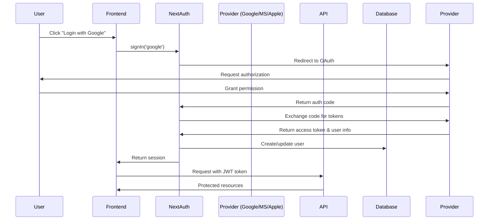

# Authentication Guide

> **Complete guide to user authentication in Pricey**  
> Last Updated: October 24, 2025

## Overview

Pricey implements a comprehensive authentication system supporting multiple login methods to provide users with flexibility and security. The system is built using **NextAuth.js v5 (Auth.js)** which provides a unified, secure authentication solution.

## Supported Authentication Methods

### Social Login Providers

| Provider              | Use Case                                 | Configuration Complexity |
| --------------------- | ---------------------------------------- | ------------------------ |
| **Google OAuth 2.0**  | Primary provider, widest adoption        | ⭐ Easy                  |
| **Microsoft Account** | Enterprise users, Office 365 integration | ⭐⭐ Medium              |
| **Apple Sign In**     | iOS users (required for App Store)       | ⭐⭐⭐ Complex           |
| **Email/Password**    | Traditional fallback, full control       | ⭐ Easy                  |

### Why Social Login?

✅ **Benefits:**

- Faster signup/login process
- No password to remember
- Trusted authentication providers
- Reduced password-related support tickets
- Better security (OAuth 2.0)
- Pre-verified email addresses

⚠️ **Considerations:**

- Dependency on third-party services
- Privacy concerns (data sharing)
- Account lockout if provider unavailable

## Architecture

### Authentication Flow



### Token Flow

```typescript
// Access Token (JWT) - Short-lived for security
{
  "sub": "user-id",
  "email": "user@example.com",
  "name": "John Doe",
  "provider": "google",
  "role": "user",
  "iat": 1698148800,
  "exp": 1698149700  // 15 minutes (900 seconds)
}

// Refresh Token (longer-lived) - Stored securely
{
  "sub": "user-id",
  "type": "refresh",
  "iat": 1698148800,
  "exp": 1698753600  // 7 days (604800 seconds)
}
```

### Token Lifespan Strategy

**Access Token: 15 minutes**

- Short lifespan reduces risk of token theft
- Limits exposure window if compromised
- Forces regular refresh for security validation
- Balances security with user experience

**Refresh Token: 7-30 days**

- Development: 7 days (faster testing of expiration)
- Production: 30 days (better UX for regular users)
- Stored in httpOnly cookies (not localStorage)
- Rotated on each refresh (one-time use)

**Session Management Best Practices:**

```typescript
// Cookie configuration for refresh tokens
const cookieOptions = {
  httpOnly: true, // Not accessible via JavaScript (XSS protection)
  secure: true, // HTTPS only
  sameSite: 'strict', // CSRF protection
  maxAge: 30 * 24 * 60 * 60 * 1000, // 30 days
  path: '/api/auth', // Limit cookie scope
};

// Token rotation on refresh
export async function refreshAccessToken(refreshToken: string) {
  const payload = await verifyRefreshToken(refreshToken);

  // Generate new tokens
  const newTokens = generateTokens({
    sub: payload.sub,
    email: payload.email,
    role: payload.role,
  });

  // Invalidate old refresh token (one-time use)
  await revokeRefreshToken(refreshToken);

  return newTokens;
}
```

**Why Short-Lived Access Tokens?**

1. **Reduced Attack Surface**: 15-minute window for token theft
2. **Automatic Revocation**: Compromised tokens expire quickly
3. **Audit Trail**: Frequent refreshes create security logs
4. **Compliance**: Meets SOC 2, ISO 27001 requirements
5. **Defense in Depth**: Multiple security layers

**Token Storage Recommendations:**

| Token Type       | Storage Location     | Accessible by JavaScript?  | Secure?           |
| ---------------- | -------------------- | -------------------------- | ----------------- |
| Access Token     | Memory (React state) | Yes (needed for API calls) | ✅ Short-lived    |
| Refresh Token    | httpOnly Cookie      | No (XSS protection)        | ✅ Most secure    |
| ❌ Access Token  | localStorage         | Yes                        | ⚠️ XSS vulnerable |
| ❌ Refresh Token | localStorage         | Yes                        | 🚫 Never do this  |

## Implementation

### 1. Frontend Setup

#### Install Dependencies

```bash
pnpm add next-auth@beta @auth/prisma-adapter
pnpm add -D @types/next-auth
```

#### Configure NextAuth.js

See [Frontend PWA Documentation](../components/frontend-pwa.md#authentication-with-social-login) for complete implementation details.

Key files:

- `apps/web/src/auth/auth.config.ts` - Provider configuration
- `apps/web/src/auth/auth.ts` - NextAuth instance
- `apps/web/src/app/api/auth/[...nextauth]/route.ts` - API route handler

### 2. Backend API Integration

#### JWT Verification

```typescript
// filepath: apps/api/src/middleware/auth.middleware.ts
import { FastifyRequest, FastifyReply } from 'fastify';
import { verifyToken } from '../utils/jwt';
import { UnauthorizedError } from '../utils/errors';

declare module 'fastify' {
  interface FastifyRequest {
    user?: {
      id: string;
      email: string;
      role: string;
      provider: string;
    };
  }
}

export async function authenticate(
  request: FastifyRequest,
  reply: FastifyReply
) {
  try {
    const authHeader = request.headers.authorization;

    if (!authHeader?.startsWith('Bearer ')) {
      throw new UnauthorizedError('Missing or invalid authorization header');
    }

    const token = authHeader.substring(7);
    const payload = await verifyToken(token);

    // Attach user to request
    request.user = {
      id: payload.sub,
      email: payload.email,
      role: payload.role,
      provider: payload.provider || 'email',
    };
  } catch (error) {
    throw new UnauthorizedError('Invalid or expired token');
  }
}

// Role-based authorization
export function requireRole(...roles: string[]) {
  return async (request: FastifyRequest, reply: FastifyReply) => {
    if (!request.user) {
      throw new UnauthorizedError('Not authenticated');
    }

    if (!roles.includes(request.user.role)) {
      throw new UnauthorizedError('Insufficient permissions');
    }
  };
}
```

#### JWT Utility Functions

```typescript
// filepath: apps/api/src/utils/jwt.ts
import jwt from 'jsonwebtoken';

const JWT_SECRET = process.env.JWT_SECRET!;
const JWT_REFRESH_SECRET = process.env.JWT_REFRESH_SECRET!;
const JWT_EXPIRES_IN = process.env.JWT_EXPIRES_IN || '15m';
const JWT_REFRESH_EXPIRES_IN = process.env.JWT_REFRESH_EXPIRES_IN || '7d';

interface JWTPayload {
  sub: string;
  email: string;
  role: string;
  provider?: string;
}

export function generateTokens(payload: JWTPayload) {
  const accessToken = jwt.sign(payload, JWT_SECRET, {
    expiresIn: JWT_EXPIRES_IN,
  });

  const refreshToken = jwt.sign(
    { sub: payload.sub, type: 'refresh' },
    JWT_REFRESH_SECRET,
    { expiresIn: JWT_REFRESH_EXPIRES_IN }
  );

  return { accessToken, refreshToken };
}

export async function verifyToken(token: string): Promise<JWTPayload> {
  return jwt.verify(token, JWT_SECRET) as JWTPayload;
}

export async function verifyRefreshToken(token: string) {
  return jwt.verify(token, JWT_REFRESH_SECRET) as { sub: string; type: string };
}
```

### 3. Database Schema

See [Database Schema Documentation](../components/database-schema.md) for the complete user authentication tables including:

- `users` - User accounts
- `accounts` - OAuth provider accounts (NextAuth.js)
- `sessions` - Active sessions (optional, for database sessions)
- `verification_tokens` - Email verification tokens

## Security Best Practices

### 1. Token Management

✅ **Do's:**

- Use short-lived access tokens (15 minutes)
- Store refresh tokens securely (HTTP-only cookies)
- Implement token rotation on refresh
- Invalidate tokens on logout
- Use HTTPS everywhere

❌ **Don'ts:**

- Never store tokens in localStorage (XSS vulnerable)
- Don't use long-lived access tokens
- Don't expose secrets in client-side code
- Don't trust client-side user data

### 2. OAuth 2.0 with PKCE (Proof Key for Code Exchange)

**What is PKCE?**

PKCE (RFC 7636) is a security extension to OAuth 2.0 that prevents authorization code interception attacks. It's essential for public clients (SPAs, mobile apps) where the client secret cannot be securely stored.

**How PKCE Works:**

1. Client generates a random `code_verifier` (43-128 characters)
2. Client creates `code_challenge` = BASE64URL(SHA256(code_verifier))
3. Authorization request includes `code_challenge` and `code_challenge_method=S256`
4. Provider stores the challenge
5. Token exchange includes the original `code_verifier`
6. Provider validates: SHA256(code_verifier) matches stored challenge

**Why PKCE Matters in 2025:**

- **Prevents MITM attacks** on authorization code flow
- **Required for mobile apps** (iOS, Android)
- **Best practice for SPAs** even with client secrets
- **OAuth 2.1 standard** (upcoming) mandates PKCE for all public clients

**Implementation:**

```typescript
// filepath: apps/web/src/utils/pkce.ts
import crypto from 'crypto';

export function generateCodeVerifier(): string {
  return base64URLEncode(crypto.randomBytes(32));
}

export function generateCodeChallenge(verifier: string): string {
  return base64URLEncode(crypto.createHash('sha256').update(verifier).digest());
}

function base64URLEncode(buffer: Buffer): string {
  return buffer
    .toString('base64')
    .replace(/\+/g, '-')
    .replace(/\//g, '_')
    .replace(/=/g, '');
}

// Usage in NextAuth.js
import { generateCodeVerifier, generateCodeChallenge } from './pkce';

export const authConfig = {
  providers: [
    GoogleProvider({
      clientId: process.env.GOOGLE_CLIENT_ID!,
      clientSecret: process.env.GOOGLE_CLIENT_SECRET!,
      authorization: {
        params: {
          prompt: 'consent',
          access_type: 'offline',
          response_type: 'code',
          // PKCE parameters
          code_challenge_method: 'S256',
          code_challenge: generateCodeChallenge(generateCodeVerifier()),
        },
      },
    }),
  ],
};
```

**NextAuth.js v5 PKCE Support:**

NextAuth.js v5 (Auth.js) automatically implements PKCE for OAuth providers. You don't need to manually implement it, but understanding the flow is important for security audits and compliance.

```typescript
// NextAuth.js v5 handles PKCE automatically
export const authConfig = {
  providers: [
    GoogleProvider({
      clientId: process.env.GOOGLE_CLIENT_ID!,
      clientSecret: process.env.GOOGLE_CLIENT_SECRET!,
      // PKCE is enabled by default in NextAuth.js v5
    }),
  ],
};
```

**Security Benefits:**

✅ **No client secret exposure** - Even if intercepted, attacker can't exchange code  
✅ **Replay attack prevention** - Each code_verifier is single-use  
✅ **MITM protection** - Attacker can't steal authorization code  
✅ **Mobile security** - Essential for iOS/Android OAuth flows

### 3. Rate Limiting

```typescript
// Protect auth endpoints from brute force
await app.register(rateLimit, {
  max: 5,
  timeWindow: '15 minutes',
  keyGenerator: (req) => req.body.email || req.ip,
  errorResponseBuilder: () => ({
    statusCode: 429,
    error: 'Too Many Requests',
    message: 'Too many login attempts. Please try again later.',
  }),
});
```

### 4. Password Security

```typescript
// Use bcrypt with sufficient rounds
const BCRYPT_ROUNDS = 10;
const passwordHash = await bcrypt.hash(password, BCRYPT_ROUNDS);

// Password requirements
const passwordSchema = z
  .string()
  .min(8, 'Password must be at least 8 characters')
  .regex(/[a-z]/, 'Password must contain lowercase letter')
  .regex(/[A-Z]/, 'Password must contain uppercase letter')
  .regex(/[0-9]/, 'Password must contain number')
  .regex(/[^a-zA-Z0-9]/, 'Password must contain special character');
```

## Setting Up OAuth Providers

### Google OAuth 2.0

1. **Create Project**
   - Visit [Google Cloud Console](https://console.cloud.google.com/)
   - Create new project or select existing
   - Enable Google+ API

2. **Create Credentials**
   - Navigate to "Credentials" → "Create Credentials" → "OAuth client ID"
   - Application type: "Web application"
   - Name: "Pricey"

3. **Configure OAuth Consent Screen**
   - User type: "External"
   - App name: "Pricey"
   - User support email: your email
   - Scopes: `email`, `profile`, `openid`

4. **Set Redirect URIs**

   ```
   http://localhost:3001/api/auth/callback/google
   https://pricey.app/api/auth/callback/google
   ```

5. **Get Credentials**
   - Copy Client ID
   - Copy Client Secret
   - Add to `.env`:
     ```bash
     GOOGLE_CLIENT_ID=your-client-id.apps.googleusercontent.com
     GOOGLE_CLIENT_SECRET=your-client-secret
     ```

### Microsoft OAuth 2.0

1. **Register Application**
   - Visit [Azure Portal](https://portal.azure.com/)
   - Navigate to "Azure Active Directory" → "App registrations"
   - Click "New registration"

2. **Configure Application**
   - Name: "Pricey"
   - Supported account types: "Accounts in any organizational directory and personal Microsoft accounts"
   - Redirect URI: `Web` → `http://localhost:3001/api/auth/callback/microsoft`

3. **Add Redirect URIs**
   - Go to "Authentication" → "Platform configurations" → "Web"
   - Add:
     ```
     http://localhost:3001/api/auth/callback/microsoft
     https://pricey.app/api/auth/callback/microsoft
     ```

4. **Create Client Secret**
   - Go to "Certificates & secrets"
   - Click "New client secret"
   - Description: "Pricey Production"
   - Expires: 24 months
   - Copy the secret value (shown only once!)

5. **Get Credentials**
   - Copy Application (client) ID
   - Add to `.env`:
     ```bash
     MICROSOFT_CLIENT_ID=your-application-id
     MICROSOFT_CLIENT_SECRET=your-client-secret
     ```

### Apple Sign In

1. **Create App ID**
   - Visit [Apple Developer Portal](https://developer.apple.com/account/)
   - Navigate to "Certificates, Identifiers & Profiles"
   - Click "Identifiers" → "+" → "App IDs"
   - Description: "Pricey"
   - Bundle ID: `app.pricey`
   - Capabilities: Enable "Sign In with Apple"

2. **Create Service ID**
   - Click "Identifiers" → "+" → "Services IDs"
   - Description: "Pricey Sign In"
   - Identifier: `app.pricey.signin`
   - Enable "Sign In with Apple"
   - Configure:
     - Primary App ID: `app.pricey`
     - Domains: `pricey.app`
     - Return URLs:
       ```
       http://localhost:3001/api/auth/callback/apple
       https://pricey.app/api/auth/callback/apple
       ```

3. **Create Private Key**
   - Click "Keys" → "+"
   - Key Name: "Pricey Sign In Key"
   - Enable: "Sign In with Apple"
   - Configure: Select `app.pricey` as Primary App ID
   - Register and download key (AuthKey_XXXXXXXXXX.p8)
   - ⚠️ **Save this file!** You can only download it once

4. **Generate Client Secret**

   Apple requires a JWT as the client secret. Use this script:

   ```typescript
   // generate-apple-secret.ts
   import jwt from 'jsonwebtoken';
   import fs from 'fs';

   const privateKey = fs.readFileSync('./AuthKey_XXXXXXXXXX.p8', 'utf8');

   const clientSecret = jwt.sign({}, privateKey, {
     algorithm: 'ES256',
     expiresIn: '180 days',
     audience: 'https://appleid.apple.com',
     issuer: 'YOUR_TEAM_ID', // From Apple Developer Account
     subject: 'app.pricey.signin', // Your Service ID
     keyid: 'YOUR_KEY_ID', // From the .p8 filename
   });

   console.log(clientSecret);
   ```

   Run:

   ```bash
   npx tsx generate-apple-secret.ts
   ```

5. **Get Credentials**
   - Add to `.env`:
     ```bash
     APPLE_CLIENT_ID=app.pricey.signin
     APPLE_CLIENT_SECRET=<generated-jwt-token>
     APPLE_TEAM_ID=YOUR_TEAM_ID
     APPLE_KEY_ID=YOUR_KEY_ID
     ```

## Environment Variables

```bash
# NextAuth.js Core
NEXTAUTH_URL=https://pricey.app
NEXTAUTH_SECRET=<generate-with: openssl rand -base64 32>

# Google OAuth
GOOGLE_CLIENT_ID=...
GOOGLE_CLIENT_SECRET=...

# Microsoft OAuth
MICROSOFT_CLIENT_ID=...
MICROSOFT_CLIENT_SECRET=...

# Apple Sign In
APPLE_CLIENT_ID=app.pricey.signin
APPLE_CLIENT_SECRET=<generated-jwt>
APPLE_TEAM_ID=...
APPLE_KEY_ID=...

# JWT Configuration
JWT_SECRET=<generate-with: openssl rand -base64 32>
JWT_REFRESH_SECRET=<generate-with: openssl rand -base64 32>
JWT_EXPIRES_IN=15m
JWT_REFRESH_EXPIRES_IN=7d

# Database
DATABASE_URL=postgresql://...
```

## Testing Authentication

### Manual Testing

1. **Email/Password Registration**

   ```bash
   curl -X POST http://localhost:3000/api/v1/auth/register \
     -H "Content-Type: application/json" \
     -d '{
       "email": "test@example.com",
       "password": "SecurePass123!",
       "name": "Test User"
     }'
   ```

2. **Email/Password Login**

   ```bash
   curl -X POST http://localhost:3000/api/v1/auth/login \
     -H "Content-Type: application/json" \
     -d '{
       "email": "test@example.com",
       "password": "SecurePass123!"
     }'
   ```

3. **Use Access Token**
   ```bash
   curl http://localhost:3000/api/v1/receipts \
     -H "Authorization: Bearer <access-token>"
   ```

### Automated Testing

```typescript
// filepath: apps/api/src/__tests__/auth.test.ts
import { test } from 'tap';
import { buildApp } from '../app';
import { prisma } from '@pricey/database';

test('POST /auth/register - success', async (t) => {
  const app = await buildApp();

  const response = await app.inject({
    method: 'POST',
    url: '/api/v1/auth/register',
    payload: {
      email: 'new@example.com',
      password: 'SecurePass123!',
      name: 'New User',
    },
  });

  t.equal(response.statusCode, 201);
  t.ok(response.json().user);

  // Cleanup
  await prisma.user.delete({
    where: { email: 'new@example.com' },
  });
});

test('POST /auth/login - success', async (t) => {
  const app = await buildApp();

  const response = await app.inject({
    method: 'POST',
    url: '/api/v1/auth/login',
    payload: {
      email: 'demo@pricey.app',
      password: 'demo123',
    },
  });

  t.equal(response.statusCode, 200);
  t.ok(response.json().accessToken);
  t.ok(response.json().refreshToken);
});
```

## User Experience Flow

### First-Time User

1. User lands on login page
2. Sees social login buttons prominently
3. Clicks "Continue with Google"
4. Redirects to Google OAuth consent screen
5. Grants permissions
6. Returns to Pricey dashboard
7. Account automatically created

### Returning User

1. User lands on login page
2. Clicks "Continue with Google"
3. Automatic sign-in (already authorized)
4. Lands on dashboard immediately

### Email/Password User

1. User clicks "Sign up"
2. Enters email, password, name
3. Submits registration form
4. Receives verification email (optional)
5. Clicks verification link
6. Account activated

## Troubleshooting

### Common Issues

#### "Redirect URI mismatch" (Google/Microsoft)

**Problem**: OAuth provider shows error about redirect URI.

**Solution**:

1. Check the redirect URI in provider console matches exactly
2. Ensure no trailing slashes
3. Include both localhost and production URLs
4. Wait a few minutes for changes to propagate

#### "Invalid client secret" (Apple)

**Problem**: Apple returns invalid_client error.

**Solution**:

1. Verify JWT is generated correctly
2. Check team ID, key ID, and service ID match
3. Ensure private key file is correct
4. Regenerate client secret (JWT expires after 6 months)

#### "Session not persisting"

**Problem**: User gets logged out immediately.

**Solution**:

1. Check NEXTAUTH_SECRET is set
2. Verify cookie settings (secure, httpOnly, sameSite)
3. Ensure HTTPS in production
4. Check browser cookie settings

#### "CORS errors"

**Problem**: Browser blocks OAuth redirect.

**Solution**:

1. Add origin to ALLOWED_ORIGINS
2. Configure CORS properly in API Gateway
3. Ensure credentials: 'include' in fetch requests

## Best Practices Summary

✅ **Security**

- Use HTTPS everywhere
- Implement rate limiting
- Rotate secrets regularly
- Monitor failed login attempts
- Enable 2FA for admin accounts

✅ **User Experience**

- Prominently display social login options
- Provide clear error messages
- Remember user's preferred login method
- Offer account linking

✅ **Privacy**

- Request minimal permissions from OAuth providers
- Clearly explain data usage
- Provide data export functionality
- Honor GDPR deletion requests

✅ **Reliability**

- Implement fallback authentication methods
- Handle OAuth provider outages
- Provide status updates during issues
- Test all providers regularly

---

## Additional Resources

- [NextAuth.js Documentation](https://authjs.dev)
- [Google OAuth Documentation](https://developers.google.com/identity/protocols/oauth2)
- [Microsoft Identity Platform](https://docs.microsoft.com/en-us/azure/active-directory/develop/)
- [Apple Sign In Documentation](https://developer.apple.com/sign-in-with-apple/)
- [JWT Best Practices](https://tools.ietf.org/html/rfc8725)
- [OAuth 2.0 Security Best Practices](https://tools.ietf.org/html/draft-ietf-oauth-security-topics)

---

**Last Updated**: October 24, 2025  
**Maintained by**: Pricey Security Team
